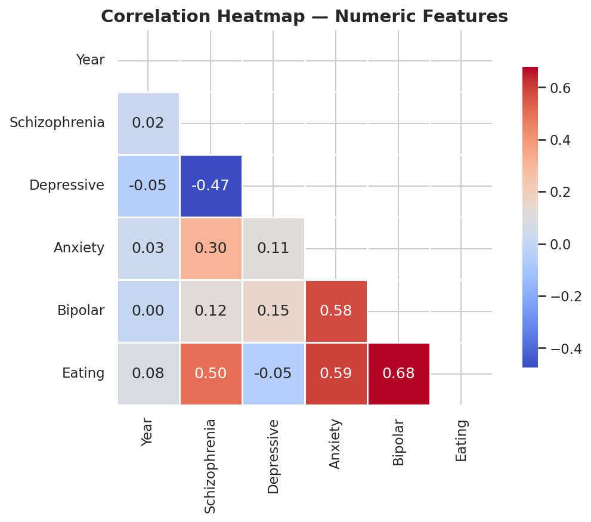
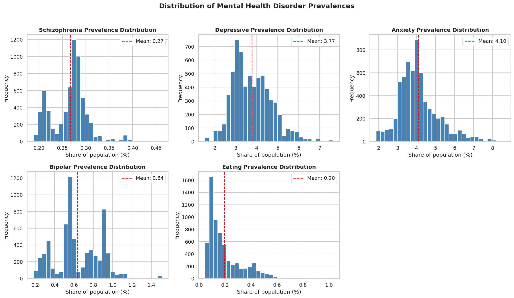
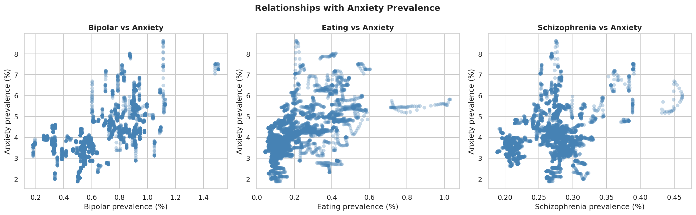
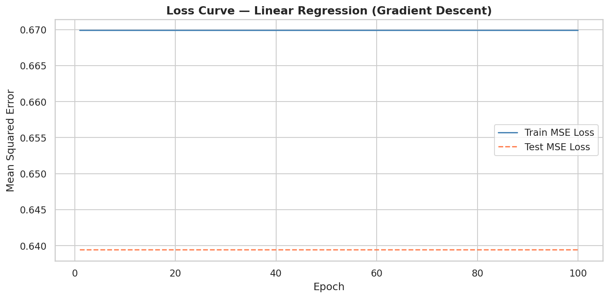
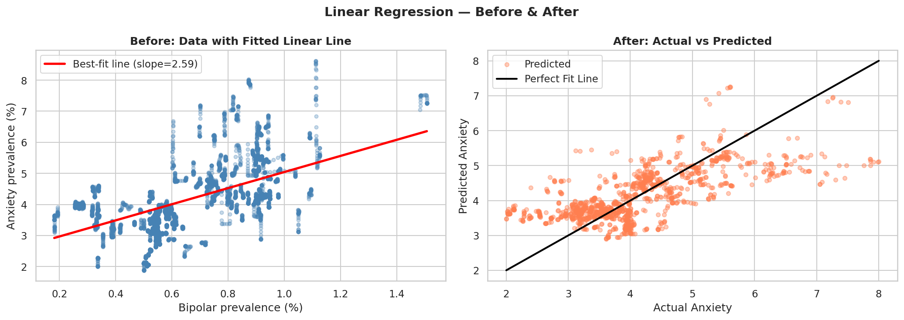
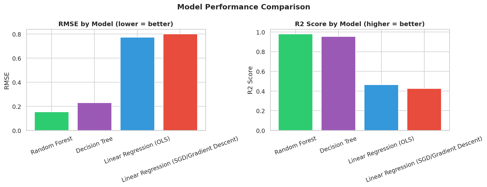

# Mental Health: Anxiety Prevalence Prediction (Linear Regression Summative)

## Mission
Predict a country's **Anxiety disorder prevalence** (share of population, age-standardized) for a given year, using its other mental-health disorder prevalences plus geographic (country) and temporal (year) context. This supports estimating anxiety burden for country-years where direct anxiety surveillance is sparse or missing.

## Problem Statement
Global mental-health surveillance is uneven because many countries and years lack direct measurement of anxiety disorder prevalence, while other indicators (depression, bipolar, schizophrenia, eating disorders) are more consistently reported. A regression model that estimates anxiety prevalence from these related indicators and from country/year context gives public-health analysts a defensible way to fill gaps and study cross-disorder relationships.

## Dataset
- **Name:** Mental Illnesses Prevalence (Our World in Data / IHME Global Burden of Disease)
- **Source:** https://www.kaggle.com/datasets/imtkaggleteam/mental-health
- **File used:** `mental_illnesses_prevalence.csv`
- **Records:** 6,419 rows (214 countries/entities × 30 years, 1990–2019)
- **Columns:** country, ISO code, year, and 5 disorder prevalences

## Visualizations

**Correlation heatmap** — Bipolar (0.58) and Eating (0.59) correlate most strongly with Anxiety; Schizophrenia is moderate (0.30); Depressive is weak (0.11).



**Distributions** — anxiety prevalence is right-skewed, continuous, and well-suited as a regression target.



**Scatterplots vs Anxiety** — Bipolar and Eating rise together with Anxiety, showing usable linear structure.



**Loss curve (train vs test)** and **before/after best-fit line:**




**Model comparison:**



## Features & Encoding

| Column | Role | Notes |
|---|---|---|
| Entity (country) | Feature (categorical) | **Label-encoded** to integers 0–213 — this is the column converted to numeric. Mapping saved in `country_codes.json`. |
| Code (ISO) | **Dropped** | Redundant one-to-one duplicate of Entity, and the only source of missing values. |
| Year | Feature (numeric) | 1990–2019; captures temporal trend. |
| Schizophrenia | Feature (numeric) | Prevalence, share of population (%). |
| Depressive | Feature (numeric) | Prevalence (%). |
| Bipolar | Feature (numeric) | Prevalence (%). |
| Eating | Feature (numeric) | Prevalence (%). |
| **Anxiety** | **Target** | Prevalence (%) — the value being predicted. |

All features are standardized with `StandardScaler` (fit on the training set only) before training.

## Models Trained

| Model | Details | Test RMSE | Test R² |
|---|---|---|---|
| Linear Regression (SGD / Gradient Descent) | SGDRegressor, 100 epochs, loss curve tracked | 0.800 | 0.426 |
| Linear Regression (OLS) | Closed-form scikit-learn LinearRegression | 0.773 | 0.464 |
| Decision Tree | DecisionTreeRegressor, max_depth=10 | 0.230 | 0.952 |
| **Random Forest** | RandomForestRegressor, 100 trees, max_depth=10 | **0.155** | **0.979** |

**Best model (lowest RMSE): Random Forest** — saved as `best_model.pkl`. The linear models underperform because country-level prevalence is highly non-linear across the 214 encoded entities, which the ensemble captures far better.

## API

**Live Swagger UI:** https://mental-health-anxiety-predictor.onrender.com/docs

**Prediction Endpoint:** POST https://mental-health-anxiety-predictor.onrender.com/predict

**Retraining Endpoint:** POST https://mental-health-anxiety-predictor.onrender.com/retrain

> Hosted on Render free tier — if the first request is slow, wait ~30 seconds for the instance to wake up.

### CORS configuration & reasoning
The API uses `CORSMiddleware` with an **explicit allow-list**, not the wildcard `*`.

- **Allowed origins:** `localhost` (local Flutter web development) and the deployed Render URL of this service — so Swagger UI and legitimate front-ends can reach the API.
- **Restricted:** every other origin. The browser same-origin policy blocks unknown third-party sites from calling the API on a user's behalf, preventing CSRF-style abuse.
- **Methods:** only `GET` (health) and `POST` (predict/retrain).
- **Headers:** limited to `Content-Type`, `Authorization`, `Accept`.
- **Credentials:** allowed, so auth headers survive if authentication is added later.

### Input constraints (Pydantic)
Every field is typed and range-constrained to realistic training bounds: `Entity` int 0–213, `Year` int 1990–2019, `Schizophrenia` float 0–1, `Depressive` float 0–10, `Bipolar` float 0–3, `Eating` float 0–3. Out-of-range or missing values return HTTP 422.

## How to Run the Notebook
```bash
pip install pandas numpy matplotlib seaborn scikit-learn joblib notebook
cd summative/linear_regression
jupyter notebook multivariate.ipynb    # Kernel > Restart and Run All
```
Single prediction:
```bash
python predict.py
```

## How to Deploy the API on Render
1. Push this repo to GitHub.
2. On Render, create a new **Web Service** from the repo.
3. Root directory: `summative/API`
4. Build command: `pip install -r requirements.txt`
5. Start command: `uvicorn prediction:app --host 0.0.0.0 --port $PORT`
6. After deploy, visit `/docs` for the Swagger UI.

## How to Run the Flutter App
```bash
cd summative/FlutterApp/anxiety_predictor
flutter pub get
flutter run           # or: flutter run -d chrome / -d windows
```
Enter the 6 values and press **Predict**. Use `country_codes.json` to find a country's code.

## Key Findings
- Bipolar and Eating disorder prevalence are the strongest correlates of Anxiety.
- Country identity (Entity) carries very strong signal — prevalence is highly country-specific, which is why tree-based models dominate the linear ones.
- Random Forest reaches R² ≈ 0.98, far ahead of both linear implementations.

## Technologies Used
Python, Jupyter, pandas, numpy, matplotlib, seaborn, scikit-learn (SGDRegressor, LinearRegression, DecisionTreeRegressor, RandomForestRegressor, StandardScaler, LabelEncoder), joblib, FastAPI, Uvicorn, Pydantic, Flutter/Dart, Render.
